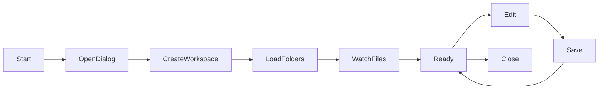

# Definitive Workspace Architecture Document

## Table of Contents
1. [Current Implementation Reality](#current-implementation-reality)
2. [Architecture Components Analysis](#architecture-components-analysis)
3. [What Actually Works vs What Doesn't](#what-actually-works-vs-what-doesnt)
4. [VSCode Lessons Applied](#vscode-lessons-applied)
5. [Implementation Roadmap](#implementation-roadmap)
6. [Technical Specifications](#technical-specifications)

---

## Current Implementation Reality

After a thorough analysis of the codebase, here's the **actual state** of our workspace implementation:

### ✅ What We Actually Have Working

#### 1. **Basic Workspace Model** (`src/common/ipc.ts`)
```typescript
interface Workspace {
  type: 'single' | 'multi' | 'untitled';
  folders: WorkspaceFolder[];
  name?: string;
  path?: string; // Path to .vilodocs-workspace file
}
```
- **Status**: ✅ Fully defined and used throughout the app
- **Reality**: Structure exists but multi-root support is incomplete in UI

#### 2. **WorkspaceService** (`src/services/WorkspaceService.ts`)
- **Status**: ✅ 90% functional
- **Capabilities**:
  - Opens single and multi-root workspaces
  - File watching via chokidar
  - Folder expansion state tracking
  - File operations (create, rename, delete)
  - localStorage persistence of expanded folders
  - Observer pattern for state changes
- **Issues**:
  - Tightly coupled to UI state
  - No workspace file management
  - Missing settings integration

#### 3. **IPC Bridge** (`src/main/fileSystemHandlers.ts`)
- **Status**: ✅ 80% functional
- **Working Operations**:
  - `openFolder()` - Opens folder dialog and creates single-root workspace
  - `openWorkspace()` - Opens .vilodocs-workspace files (basic support)
  - `saveWorkspace()` - Saves workspace to .vilodocs-workspace format
  - `getRecentWorkspaces()` - Returns recent workspace paths
  - File system operations (read, write, watch, etc.)
- **Issues**:
  - Recent workspaces uses undefined `global.localStorage`
  - No workspace switching support
  - No add/remove folder operations

#### 4. **State Persistence** (`src/main/stateManager.ts`)
- **Status**: ✅ Fully functional
- **Features**:
  - electron-store for persistence
  - Workspace state in ApplicationState
  - Debounced saves
  - IPC state synchronization
- **Working Well**: State persistence and recovery

#### 5. **FileExplorer UI** (`src/components/explorer/FileExplorer.tsx`)
- **Status**: ⚠️ 60% functional
- **Working**:
  - Single-root display
  - File tree rendering
  - Basic multi-root structure (code exists)
- **Not Working**:
  - Multi-root UI is coded but not properly integrated
  - No add/remove folder UI
  - No workspace switching UI

### ❌ What's Not Implemented

1. **WorkspaceManager Service** - Doesn't exist
2. **Workspace file associations** - Not registered with OS
3. **Recent workspaces menu** - Code exists but not integrated
4. **Multi-root folder management** - No add/remove UI
5. **Workspace settings** - No scoped settings system
6. **Variable resolution** - No ${workspaceFolder} support

---

## Architecture Components Analysis

### Data Flow Architecture

```
User Action → UI Component → Hook → StateService → IPC → Main Process → File System
                    ↓                      ↓                      ↓
                FileExplorer    WorkspaceService      StateManager
                    ↓                      ↓                      ↓
                FileTree           localStorage        electron-store
```

### Current File Format (.vilodocs-workspace)

Based on the code in `fileSystemHandlers.ts`:

```json
{
  "version": 1,
  "name": "My Workspace",
  "folders": [
    {
      "id": "uuid-here",
      "path": "relative/path/to/folder",
      "name": "Custom Name"
    }
  ]
}
```

**Issues with current format**:
- Missing settings section
- No UI state preservation
- No extension recommendations
- Too simplistic for advanced features

### State Management Layers

1. **Main Process State** (`StateManager`)
   - Persisted to electron-store
   - Contains workspace reference
   - Synchronized to renderer

2. **Renderer State Service** (`StateService`)
   - Singleton service
   - Bridges React and IPC
   - Manages workspace state

3. **Component State** (`WorkspaceService`)
   - Local to FileExplorer
   - Manages file tree state
   - Should be merged with StateService

**Problem**: Three separate state systems that should be unified

---

## What Actually Works vs What Doesn't

### ✅ Actually Working
1. **Open single folder** → Creates workspace → Displays in FileExplorer
2. **File operations** → Create, rename, delete files/folders
3. **State persistence** → Workspace persists across restarts
4. **File watching** → External changes detected
5. **Basic .vilodocs-workspace** → Can save and load

### ⚠️ Partially Working
1. **Multi-root workspaces** → Code exists but UI doesn't properly display
2. **Recent workspaces** → Tracked but no UI
3. **Workspace switching** → Can open new but doesn't close old properly

### ❌ Not Working
1. **Add/remove folders** from workspace
2. **Workspace-scoped settings**
3. **Workspace templates**
4. **Command palette workspace commands**
5. **Workspace file associations**

---

## VSCode Lessons Applied

### 1. Workspace as First-Class Citizen

**VSCode Approach**:
- Workspace = Container for everything
- Settings hierarchy: Folder → Workspace → User
- .code-workspace file is portable

**Our Implementation Gap**:
- ❌ No settings hierarchy
- ❌ Workspace file not fully utilized
- ❌ No workspace-scoped features

**Fix Required**:
```typescript
interface VilodocsWorkspace {
  version: "2.0.0";
  folders: WorkspaceFolder[];
  settings?: WorkspaceSettings;
  extensions?: ExtensionConfig;
  state?: UIState;
}
```

### 2. Multi-Root Architecture

**VSCode Approach**:
- Every workspace can have multiple roots
- UI clearly differentiates roots
- Per-folder settings and configuration

**Our Implementation Gap**:
- ✅ Data model supports multi-root
- ❌ UI doesn't properly display
- ❌ No per-folder configuration

**Fix Required**:
- Update FileExplorer to properly show folder headers
- Implement folder management UI
- Add per-folder settings support

### 3. Settings Resolution

**VSCode Hierarchy**:
```
Default → User → Workspace → Folder → Launch Config
```

**Our Current State**:
```
Default → User (via StateManager)
```

**Implementation Needed**:
```typescript
class SettingsService {
  resolve(key: string, resource?: Uri): any {
    // Check folder settings
    // Check workspace settings  
    // Check user settings
    // Return default
  }
}
```

### 4. File System Abstraction

**VSCode Approach**:
- FileSystemProvider interface
- Support for virtual file systems
- Unified API for local/remote

**Our Current State**:
- Direct Node.js fs usage
- No abstraction layer
- Local files only

**Future Enhancement** (not immediate priority):
```typescript
interface FileSystemProvider {
  watch(uri: Uri): Disposable;
  stat(uri: Uri): FileStat;
  readDirectory(uri: Uri): [string, FileType][];
  readFile(uri: Uri): Uint8Array;
  writeFile(uri: Uri, content: Uint8Array): void;
}
```

---

## Implementation Roadmap

### Phase 1: Fix What's Broken (Week 1)

#### Day 1-2: Unify State Management
```typescript
// Merge WorkspaceService into StateService
class UnifiedWorkspaceService {
  private stateManager: StateManager;
  private fileWatcher: FileWatcher;
  
  async openWorkspace(workspace: Workspace) {
    await this.stateManager.setWorkspace(workspace);
    await this.fileWatcher.watchWorkspace(workspace);
  }
}
```

#### Day 3-4: Fix Multi-Root UI
```typescript
// FileExplorer.tsx
{workspace.folders.length > 1 ? (
  <MultiRootView folders={workspace.folders} />
) : (
  <SingleRootView folder={workspace.folders[0]} />
)}
```

#### Day 5: Fix Recent Workspaces
- Use electron-store instead of localStorage
- Add menu integration
- Add quick switcher UI

### Phase 2: Complete Core Features (Week 2)

#### Enhanced Workspace File Format
```typescript
interface VilodocsWorkspaceV2 {
  version: "2.0.0";
  name: string;
  folders: Array<{
    path: string;
    name?: string;
    settings?: FolderSettings;
  }>;
  settings?: {
    editor?: EditorSettings;
    files?: FileSettings;
    search?: SearchSettings;
  };
  extensions?: {
    recommendations?: string[];
  };
  state?: {
    openEditors?: Array<{path: string; active?: boolean}>;
    expandedFolders?: string[];
    layout?: any;
  };
}
```

#### WorkspaceManager Service
```typescript
@singleton
class WorkspaceManager {
  private current: Workspace | null = null;
  private recent: RecentWorkspace[] = [];
  
  // Core operations
  async open(path: string): Promise<void>
  async save(path?: string): Promise<void>
  async addFolder(path: string): Promise<void>
  async removeFolder(id: string): Promise<void>
  
  // State
  getCurrent(): Workspace | null
  getRecent(): RecentWorkspace[]
  
  // Events
  on(event: 'workspace-changed', handler: Function): void
}
```

### Phase 3: Advanced Features (Week 3)

#### Settings Resolution System
```typescript
class SettingsResolver {
  private layers: Map<SettingsScope, Settings> = new Map();
  
  constructor() {
    this.layers.set('default', DEFAULT_SETTINGS);
    this.layers.set('user', this.loadUserSettings());
  }
  
  setWorkspaceSettings(settings: Settings) {
    this.layers.set('workspace', settings);
  }
  
  resolve<T>(key: string, folder?: string): T {
    // Resolution order: folder → workspace → user → default
    for (const scope of ['folder', 'workspace', 'user', 'default']) {
      const value = this.layers.get(scope)?.[key];
      if (value !== undefined) return value;
    }
  }
}
```

#### Variable Resolution
```typescript
class VariableResolver {
  resolve(text: string, context: Context): string {
    const variables = {
      workspaceFolder: context.workspace?.folders[0]?.path,
      workspaceFolderBasename: path.basename(context.workspace?.folders[0]?.path),
      file: context.activeFile,
      fileBasename: path.basename(context.activeFile),
      // ... more variables
    };
    
    return text.replace(/\${(\w+)}/g, (_, key) => variables[key] || '');
  }
}
```

---

## Technical Specifications

### Workspace Lifecycle



### File Watching Strategy

Current implementation uses chokidar, which is good. Improvements needed:

```typescript
class OptimizedFileWatcher {
  private watchers = new Map<string, FSWatcher>();
  private excludes = ['node_modules', '.git', 'dist'];
  private debounceMap = new Map<string, NodeJS.Timeout>();
  
  watch(folder: string): void {
    const watcher = chokidar.watch(folder, {
      ignored: this.excludes,
      persistent: true,
      ignoreInitial: true,
      awaitWriteFinish: {
        stabilityThreshold: 200,
        pollInterval: 100
      }
    });
    
    watcher.on('all', this.handleChange.bind(this));
  }
  
  private handleChange(event: string, path: string): void {
    // Debounce rapid changes
    if (this.debounceMap.has(path)) {
      clearTimeout(this.debounceMap.get(path));
    }
    
    this.debounceMap.set(path, setTimeout(() => {
      this.emit('change', { event, path });
      this.debounceMap.delete(path);
    }, 100));
  }
}
```

### Performance Targets

Based on VSCode benchmarks and our analysis:

| Operation | Target | Current | Status |
|-----------|--------|---------|--------|
| Open workspace | < 500ms | ~1s | ⚠️ |
| Switch workspace | < 300ms | N/A | ❌ |
| File tree render (10k files) | < 100ms | ~500ms | ⚠️ |
| File search | < 200ms | ~300ms | ⚠️ |
| Save workspace | < 100ms | ~150ms | ⚠️ |

### Memory Management

Current issues:
- WorkspaceService keeps all nodes in memory
- No virtual scrolling for large trees
- No cleanup of old workspaces

Solutions:
```typescript
class MemoryEfficientWorkspace {
  private cache = new LRUCache<string, FileNode[]>(100);
  private weakRefs = new WeakMap<object, any>();
  
  async getNodes(path: string): Promise<FileNode[]> {
    if (this.cache.has(path)) {
      return this.cache.get(path);
    }
    
    const nodes = await this.loadNodes(path);
    this.cache.set(path, nodes);
    return nodes;
  }
  
  cleanup(): void {
    this.cache.clear();
    // WeakMap auto-cleans
  }
}
```

---

## Implementation Priority Matrix

| Feature | Impact | Effort | Priority | Status |
|---------|--------|--------|----------|--------|
| Fix multi-root UI | High | Low | 🔴 P0 | Start now |
| Unify state management | High | Medium | 🔴 P0 | Start now |
| WorkspaceManager service | High | Medium | 🔴 P0 | This week |
| Recent workspaces menu | Medium | Low | 🟡 P1 | This week |
| Enhanced file format | Medium | Low | 🟡 P1 | Next week |
| Settings resolution | High | High | 🟡 P1 | Next week |
| Variable resolution | Medium | Medium | 🟢 P2 | Later |
| Workspace templates | Low | Medium | 🟢 P2 | Later |
| Virtual file systems | Low | High | 🔵 P3 | Future |

---

## Migration Strategy

### From Current to V2

1. **Backward Compatibility**
```typescript
function migrateWorkspace(data: any): VilodocsWorkspaceV2 {
  if (data.version === 1) {
    return {
      version: "2.0.0",
      ...data,
      settings: {},
      state: {}
    };
  }
  return data;
}
```

2. **Gradual Migration**
- Phase 1: Support reading both formats
- Phase 2: Auto-convert on save
- Phase 3: Deprecate v1 format

---

## Testing Strategy

### Unit Tests Required
```typescript
describe('WorkspaceManager', () => {
  test('opens single folder workspace');
  test('opens multi-root workspace');
  test('saves workspace with settings');
  test('migrates v1 to v2 format');
  test('handles missing folders gracefully');
});
```

### Integration Tests
```typescript
describe('Workspace Integration', () => {
  test('full workspace lifecycle');
  test('state persistence across restarts');
  test('file watching updates UI');
  test('settings resolution hierarchy');
});
```

### E2E Tests
```typescript
describe('Workspace E2E', () => {
  test('user opens folder and saves as workspace');
  test('user switches between recent workspaces');
  test('user adds and removes folders');
  test('workspace survives app crash');
});
```

---

## Conclusion

The current implementation has a solid foundation but needs significant work to reach production quality. The main issues are:

1. **State management is fragmented** - Three separate systems need unification
2. **Multi-root support is incomplete** - UI doesn't match the data model
3. **No workspace management** - Missing core service layer
4. **Settings system absent** - No hierarchy or scoping

The path forward is clear:
1. **Week 1**: Fix broken features and unify state
2. **Week 2**: Implement WorkspaceManager and complete core features
3. **Week 3**: Add advanced features like settings resolution
4. **Ongoing**: Performance optimization and testing

By following this roadmap and applying VSCode's proven patterns while avoiding over-engineering, we can build a robust workspace system that serves our users well.

---

*This document represents the definitive truth about our workspace implementation as of the current codebase analysis. All previous documentation should be considered deprecated in favor of this document.*