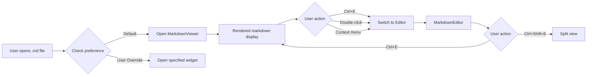

# Markdown System Specification

## Overview

This document specifies the complete markdown system for Vilodocs, providing a comprehensive markdown experience that rivals dedicated markdown editors like Obsidian and Typora while maintaining the flexibility of VS Code.

## Core Principle

**Markdown files (.md) open in rendered view by default**, with seamless transitions to editing modes when needed. This provides the best reading experience while keeping powerful editing capabilities one keystroke away.

## Architecture

### Widget Types

```typescript
interface MarkdownWidgetTypes {
  'markdown-viewer': MarkdownViewerWidget;    // Read-only rendered view (default)
  'markdown-editor': MarkdownEditorWidget;    // Edit mode with syntax highlighting
  'markdown-split': MarkdownSplitWidget;      // Side-by-side editor + preview
}
```

### File Opening Flow



## Component Specifications

### 1. MarkdownViewer Widget

**Purpose**: Default widget for viewing markdown files in rendered format

**Features**:
```typescript
interface MarkdownViewerWidget {
  // Core functionality
  render(markdown: string): ReactElement;
  scrollToLine(line: number): void;
  scrollToHeading(headingId: string): void;
  
  // Interactive features
  onLinkClick(url: string): void;
  onCodeCopy(code: string): void;
  onHeadingToggle(headingId: string): void;
  
  // Mode switching
  switchToEdit(options?: { line?: number }): void;
  switchToSplit(): void;
  
  // Export
  exportAsPDF(): Promise<void>;
  exportAsHTML(): Promise<string>;
}
```

**Rendering Pipeline**:
```typescript
markdown 
  → remark.parse()
  → remark-gfm (tables, strikethrough, etc.)
  → remark-math (LaTeX math)
  → remark-mermaid (diagrams)
  → remark-prism (syntax highlighting)
  → remark-react (React components)
  → Rendered output
```

**UI Elements**:
- Table of contents sidebar (collapsible)
- Copy button on code blocks
- Clickable checkboxes for task lists
- Collapsible headers
- Zoom controls
- Reading time estimate
- Word count in status bar

### 2. MarkdownEditor Widget

**Purpose**: Full-featured markdown editor with syntax highlighting

**Features**:
```typescript
interface MarkdownEditorWidget {
  // Editor setup
  editor: MonacoEditor | CodeMirror;
  language: 'markdown';
  theme: 'vs-dark' | 'vs-light';
  
  // Markdown helpers
  insertBold(): void;
  insertItalic(): void;
  insertLink(url?: string): void;
  insertImage(path?: string): void;
  insertTable(rows: number, cols: number): void;
  insertCodeBlock(language?: string): void;
  
  // Formatting
  increaseHeading(): void;
  decreaseHeading(): void;
  toggleList(type: 'bullet' | 'numbered' | 'task'): void;
  
  // Navigation
  goToHeading(): void;
  foldAll(): void;
  unfoldAll(): void;
}
```

**Toolbar**:
```typescript
const markdownToolbar = [
  { icon: 'bold', command: 'markdown.bold', shortcut: 'Ctrl+B' },
  { icon: 'italic', command: 'markdown.italic', shortcut: 'Ctrl+I' },
  { icon: 'strikethrough', command: 'markdown.strikethrough' },
  '|',
  { icon: 'heading', command: 'markdown.heading' },
  { icon: 'quote', command: 'markdown.quote' },
  '|',
  { icon: 'ul', command: 'markdown.bulletList' },
  { icon: 'ol', command: 'markdown.numberedList' },
  { icon: 'task', command: 'markdown.taskList' },
  '|',
  { icon: 'link', command: 'markdown.insertLink', shortcut: 'Ctrl+K' },
  { icon: 'image', command: 'markdown.insertImage' },
  { icon: 'table', command: 'markdown.insertTable' },
  { icon: 'code', command: 'markdown.codeBlock' },
  '|',
  { icon: 'preview', command: 'markdown.togglePreview', shortcut: 'Ctrl+Shift+V' }
];
```

### 3. MarkdownSplit Widget

**Purpose**: Side-by-side editor and preview with synchronized scrolling

**Layout**:
```typescript
interface MarkdownSplitWidget {
  layout: 'horizontal' | 'vertical';
  ratio: number; // Default 0.5 (50/50 split)
  
  leftPanel: MarkdownEditorWidget;
  rightPanel: MarkdownViewerWidget;
  
  syncService: MarkdownSyncService;
}
```

**Synchronization**:
```typescript
class MarkdownSyncService {
  private lineMap: Map<number, string>; // Editor line → Preview element ID
  private scrollSync: boolean = true;
  private cursorSync: boolean = true;
  
  // Bidirectional scrolling
  syncEditorScroll(line: number): void;
  syncPreviewScroll(elementId: string): void;
  
  // Cursor position
  highlightPreviewLine(line: number): void;
  scrollToEditorLine(elementId: string): void;
  
  // Performance
  private debounce(fn: Function, delay: number): Function;
}
```

## Mode Switching

### Transition Animations

```typescript
interface ModeTransition {
  from: WidgetType;
  to: WidgetType;
  duration: number; // milliseconds
  animation: 'fade' | 'slide' | 'morph';
  preserveScroll: boolean;
  preserveCursor: boolean;
}

const transitions: ModeTransition[] = [
  {
    from: 'markdown-viewer',
    to: 'markdown-editor',
    duration: 200,
    animation: 'morph',
    preserveScroll: true,
    preserveCursor: true
  }
];
```

### User Triggers

| Trigger | Action | From State | To State |
|---------|--------|------------|----------|
| `Ctrl+E` | Toggle edit mode | Viewer | Editor |
| `Ctrl+E` | Toggle view mode | Editor | Viewer |
| `Ctrl+Shift+E` | Open split view | Any | Split |
| Double-click | Edit at location | Viewer | Editor |
| `Esc` | Exit edit mode | Editor | Viewer |
| Context menu | Various | Any | Selected |

## File Type Detection

```typescript
interface FileTypeRegistry {
  extensions: Map<string, FileHandler>;
  mimeTypes: Map<string, FileHandler>;
}

interface FileHandler {
  extensions: string[];
  mimeTypes?: string[];
  defaultWidget: string;
  availableWidgets: string[];
  icon: string;
  contextMenu: ContextMenuItem[];
}

const markdownHandler: FileHandler = {
  extensions: ['.md', '.markdown', '.mdown', '.mkd', '.mdx'],
  mimeTypes: ['text/markdown', 'text/x-markdown'],
  defaultWidget: 'markdown-viewer',
  availableWidgets: [
    'markdown-viewer',
    'markdown-editor', 
    'markdown-split',
    'text-editor' // Fallback
  ],
  icon: 'markdown-icon',
  contextMenu: [
    { label: 'View Rendered', command: 'markdown.openViewer' },
    { label: 'Edit Markdown', command: 'markdown.openEditor' },
    { label: 'Open Split View', command: 'markdown.openSplit' }
  ]
};
```

## Rendering Features

### Supported Markdown Extensions

1. **GitHub Flavored Markdown (GFM)**
   - Tables
   - Task lists
   - Strikethrough
   - Autolinks

2. **Mathematics**
   - LaTeX inline: `$E = mc^2$`
   - LaTeX block: `$$\int_0^\infty$$`
   - MathJax or KaTeX rendering

3. **Diagrams**
   - Mermaid diagrams
   - PlantUML (optional)
   - GraphViz (optional)

4. **Code Blocks**
   - Syntax highlighting (100+ languages)
   - Line numbers
   - Copy button
   - Language indicator

5. **Extended Features**
   - Footnotes
   - Abbreviations
   - Definition lists
   - Table of contents generation
   - Emoji support

### Theme Support

```typescript
interface MarkdownTheme {
  name: string;
  styles: {
    heading: CSSProperties;
    paragraph: CSSProperties;
    code: CSSProperties;
    blockquote: CSSProperties;
    link: CSSProperties;
    // ... more elements
  };
  codeTheme: 'prism' | 'github' | 'monokai' | 'dracula';
  mathTheme: 'default' | 'stix' | 'asana';
}

const themes: MarkdownTheme[] = [
  'github',
  'github-dark',
  'minimal',
  'academic',
  'obsidian'
];
```

## Performance Optimizations

### Virtual Scrolling

```typescript
interface VirtualScroller {
  // Only render visible portions
  viewportHeight: number;
  itemHeight: number | ((index: number) => number);
  overscan: number; // Render extra items outside viewport
  
  // Large file handling
  maxRenderSize: number; // Maximum DOM nodes
  lazyRender: boolean; // Render on demand
}
```

### Caching Strategy

```typescript
interface MarkdownCache {
  // Parse cache
  parsedAST: Map<string, AST>; // File path → AST
  
  // Render cache  
  renderedHTML: Map<string, string>;
  renderedComponents: Map<string, ReactElement>;
  
  // Resource cache
  images: Map<string, Blob>;
  diagrams: Map<string, SVGElement>;
  
  // Invalidation
  invalidate(filePath: string): void;
  clear(): void;
}
```

### Incremental Updates

```typescript
interface IncrementalRenderer {
  // Only re-render changed portions
  diff(oldAST: AST, newAST: AST): ChangedNodes[];
  patchDOM(changes: ChangedNodes[]): void;
  
  // Debounced updates while typing
  updateDebounceMs: number; // Default: 300ms
}
```

## Export Functionality

### PDF Export

```typescript
interface PDFExporter {
  // Options
  pageSize: 'A4' | 'Letter' | 'Legal';
  orientation: 'portrait' | 'landscape';
  margins: { top: number; right: number; bottom: number; left: number };
  
  // Styling
  includeTableOfContents: boolean;
  includePageNumbers: boolean;
  headerTemplate?: string;
  footerTemplate?: string;
  
  // Method
  export(markdown: string, options: PDFOptions): Promise<Buffer>;
}

// Implementation using Puppeteer
async function exportToPDF(markdown: string): Promise<void> {
  const html = await renderToHTML(markdown);
  const browser = await puppeteer.launch();
  const page = await browser.newPage();
  await page.setContent(html);
  const pdf = await page.pdf({
    format: 'A4',
    printBackground: true,
    preferCSSPageSize: true
  });
  await browser.close();
  return pdf;
}
```

### HTML Export

```typescript
interface HTMLExporter {
  // Options
  standalone: boolean; // Include CSS/JS inline
  includeStyles: boolean;
  theme: string;
  
  // Method
  export(markdown: string, options: HTMLOptions): Promise<string>;
}
```

## Keyboard Shortcuts

### View Mode Shortcuts

| Shortcut | Action |
|----------|--------|
| `Ctrl+E` | Switch to edit mode |
| `Ctrl+F` | Find in document |
| `g g` | Go to top |
| `G` | Go to bottom |
| `j` | Scroll down |
| `k` | Scroll up |
| `/` | Search |
| `Ctrl+P` | Print |
| `Ctrl+Shift+P` | Export as PDF |

### Edit Mode Shortcuts

| Shortcut | Action |
|----------|--------|
| `Ctrl+B` | Bold |
| `Ctrl+I` | Italic |
| `Ctrl+K` | Insert link |
| `Ctrl+Shift+]` | Increase heading |
| `Ctrl+Shift+[` | Decrease heading |
| `Alt+Shift+F` | Format table |
| `Ctrl+Enter` | Toggle checkbox |
| `Ctrl+Space` | Autocomplete |
| `Ctrl+Shift+V` | Toggle preview |
| `Ctrl+Shift+E` | Split view |

## State Management

```typescript
interface MarkdownTabState {
  // File info
  filePath: string;
  content: string;
  lastModified: Date;
  
  // View state
  mode: 'view' | 'edit' | 'split';
  scrollPosition: {
    editor?: { line: number; column: number };
    viewer?: { top: number; element?: string };
  };
  
  // Editor state
  cursorPosition?: { line: number; column: number };
  selection?: { start: Position; end: Position };
  foldedSections?: string[];
  
  // User preferences
  fontSize?: number;
  theme?: string;
  wordWrap?: boolean;
}

interface MarkdownGlobalState {
  // Recent files
  recentMarkdownFiles: string[];
  
  // User preferences
  defaultMode: 'view' | 'edit' | 'split';
  defaultTheme: string;
  enableMath: boolean;
  enableMermaid: boolean;
  enableEmoji: boolean;
  
  // Export settings
  lastExportSettings: {
    pdf?: PDFOptions;
    html?: HTMLOptions;
  };
}
```

## Implementation Phases

### Phase 1: Basic Viewer (Week 1)
- [ ] Implement MarkdownViewer widget
- [ ] Basic remark pipeline
- [ ] File type detection
- [ ] Tab integration

### Phase 2: Rendering Features (Week 2)
- [ ] GFM support
- [ ] Math rendering
- [ ] Syntax highlighting
- [ ] Mermaid diagrams

### Phase 3: Editor Integration (Week 3)
- [ ] MarkdownEditor widget
- [ ] Mode switching
- [ ] Toolbar implementation
- [ ] Keyboard shortcuts

### Phase 4: Advanced Features (Week 4)
- [ ] Split view
- [ ] Synchronized scrolling
- [ ] Export functionality
- [ ] Performance optimizations

## Testing Strategy

### Unit Tests
- Markdown parsing accuracy
- Mode transition logic
- Keyboard shortcut handling
- Export functionality

### Integration Tests
- File opening flow
- Mode switching
- State persistence
- Widget lifecycle

### E2E Tests
- Complete markdown workflow
- Performance with large files
- Export quality verification

### Performance Tests
- Rendering speed for large documents
- Scrolling performance
- Memory usage monitoring
- Mode switching speed

## Dependencies

```json
{
  "dependencies": {
    "remark": "^15.0.0",
    "remark-react": "^9.0.0",
    "remark-gfm": "^4.0.0",
    "remark-math": "^6.0.0",
    "remark-mermaid": "^0.5.0",
    "remark-prism": "^1.3.0",
    "unified": "^11.0.0",
    "rehype": "^13.0.0",
    "katex": "^0.16.0",
    "mermaid": "^10.0.0",
    "prismjs": "^1.29.0",
    "puppeteer": "^21.0.0"
  }
}
```

## References

- [Unified Ecosystem](https://unifiedjs.com/)
- [Remark Plugins](https://github.com/remarkjs/remark/blob/main/doc/plugins.md)
- [CommonMark Spec](https://spec.commonmark.org/)
- [GitHub Flavored Markdown](https://github.github.com/gfm/)
- [VS Code Markdown](https://code.visualstudio.com/docs/languages/markdown)