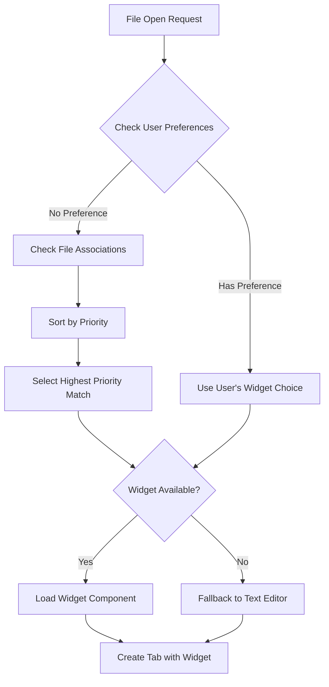

# Widget Registry Architecture

## Overview

The Widget Registry is a core architectural component that manages the relationship between file types and their associated viewer/editor widgets. This system enables vilodocs to open different file types with appropriate specialized widgets, providing optimal user experiences for each content type.

## Design Principles

1. **Extensibility**: Easy to add new widget types without modifying core code
2. **User Control**: Users can override default widget associations
3. **Performance**: Lazy loading of widget components
4. **Type Safety**: Fully typed registry and widget interfaces
5. **Consistency**: Follows existing service-oriented architecture patterns

## Architecture

### Core Components

```typescript
interface WidgetRegistry {
  // Registration
  registerWidget(type: string, provider: WidgetProvider): void;
  registerFileAssociation(pattern: string, widgetType: string, priority?: number): void;
  
  // Resolution
  getWidgetForFile(filePath: string): string;
  getWidgetProvider(type: string): WidgetProvider | undefined;
  getAvailableWidgets(filePath: string): WidgetInfo[];
  
  // Configuration
  setUserPreference(pattern: string, widgetType: string): void;
  getUserPreferences(): Map<string, string>;
  resetToDefaults(): void;
}

interface WidgetProvider {
  type: string;
  name: string;
  description: string;
  filePatterns: string[];
  priority: number;
  component: React.LazyExoticComponent<any>;
  canHandle: (filePath: string, content?: string) => boolean;
  getDefaultProps?: (filePath: string, content: string) => any;
}
```

### Widget Types

```typescript
enum WidgetType {
  // Current
  TEXT_EDITOR = 'text-editor',
  WELCOME = 'welcome',
  
  // Immediate Implementation
  MARKDOWN_VIEWER = 'markdown-viewer',
  MARKDOWN_EDITOR = 'markdown-editor',
  MARKDOWN_SPLIT = 'markdown-split',
  
  // Future
  IMAGE_VIEWER = 'image-viewer',
  PDF_VIEWER = 'pdf-viewer',
  NOTEBOOK_VIEWER = 'notebook-viewer',
  SSH_CLIENT = 'ssh-client',
  API_CLIENT = 'api-client',
  DATABASE_CLIENT = 'database-client',
  TERMINAL = 'terminal',
}
```

## Implementation Strategy

### 1. Service Layer (`src/services/WidgetRegistry.ts`)

```typescript
class WidgetRegistryService {
  private static instance: WidgetRegistryService;
  private widgets: Map<string, WidgetProvider> = new Map();
  private fileAssociations: FileAssociation[] = [];
  private userPreferences: Map<string, string> = new Map();
  
  // Singleton pattern
  static getInstance(): WidgetRegistryService {
    if (!this.instance) {
      this.instance = new WidgetRegistryService();
      this.instance.initialize();
    }
    return this.instance;
  }
  
  private initialize(): void {
    this.registerDefaultWidgets();
    this.loadUserPreferences();
  }
  
  private registerDefaultWidgets(): void {
    // Text Editor
    this.registerWidget('text-editor', {
      type: 'text-editor',
      name: 'Text Editor',
      description: 'Plain text and code editor',
      filePatterns: ['*.txt', '*.js', '*.ts', '*.jsx', '*.tsx', '*.json', '*.css', '*.html'],
      priority: 10,
      component: lazy(() => import('../components/widgets/TextEditor')),
      canHandle: () => true,
    });
    
    // Markdown Viewer
    this.registerWidget('markdown-viewer', {
      type: 'markdown-viewer',
      name: 'Markdown Viewer',
      description: 'Rendered markdown preview',
      filePatterns: ['*.md', '*.markdown', '*.mdown', '*.mkd'],
      priority: 20,
      component: lazy(() => import('../components/widgets/MarkdownViewer')),
      canHandle: (path) => /\.(md|markdown|mdown|mkd)$/i.test(path),
    });
  }
  
  getWidgetForFile(filePath: string): string {
    // Check user preferences first
    const userPref = this.getUserPreference(filePath);
    if (userPref) return userPref;
    
    // Find best matching widget by priority
    const matches = this.fileAssociations
      .filter(assoc => this.matchesPattern(filePath, assoc.pattern))
      .sort((a, b) => b.priority - a.priority);
    
    return matches[0]?.widgetType || 'text-editor';
  }
}
```

### 2. Default File Associations (`src/config/fileTypes.ts`)

```typescript
export const DEFAULT_FILE_ASSOCIATIONS: FileAssociation[] = [
  // Markdown - Opens in viewer by default
  { pattern: '*.md', widgetType: 'markdown-viewer', priority: 100 },
  { pattern: '*.markdown', widgetType: 'markdown-viewer', priority: 100 },
  
  // Code files - Opens in text editor
  { pattern: '*.js', widgetType: 'text-editor', priority: 50 },
  { pattern: '*.ts', widgetType: 'text-editor', priority: 50 },
  { pattern: '*.jsx', widgetType: 'text-editor', priority: 50 },
  { pattern: '*.tsx', widgetType: 'text-editor', priority: 50 },
  { pattern: '*.json', widgetType: 'text-editor', priority: 50 },
  { pattern: '*.css', widgetType: 'text-editor', priority: 50 },
  { pattern: '*.html', widgetType: 'text-editor', priority: 50 },
  
  // Plain text
  { pattern: '*.txt', widgetType: 'text-editor', priority: 40 },
  { pattern: '*.log', widgetType: 'text-editor', priority: 40 },
  
  // Future widgets
  { pattern: '*.ipynb', widgetType: 'notebook-viewer', priority: 100 },
  { pattern: '*.pdf', widgetType: 'pdf-viewer', priority: 100 },
  { pattern: '*.png', widgetType: 'image-viewer', priority: 100 },
  { pattern: '*.jpg', widgetType: 'image-viewer', priority: 100 },
  { pattern: '*.ssh', widgetType: 'ssh-client', priority: 100 },
  { pattern: '*.http', widgetType: 'api-client', priority: 100 },
  { pattern: '*.sql', widgetType: 'database-client', priority: 80 },
  
  // Fallback
  { pattern: '*', widgetType: 'text-editor', priority: 0 },
];
```

### 3. Widget Resolution Flow



### 4. Integration with File Opening

```typescript
// In App.tsx handleFileOpen
const handleFileOpen = useCallback((filePath: string, content: string) => {
  const registry = WidgetRegistryService.getInstance();
  const widgetType = registry.getWidgetForFile(filePath);
  const provider = registry.getWidgetProvider(widgetType);
  
  const widget = {
    type: widgetType,
    props: provider?.getDefaultProps?.(filePath, content) || { content, filePath }
  };
  
  dispatch({
    type: 'ADD_TAB',
    payload: {
      leafId,
      tab: {
        id: generateFileTabId(filePath),
        title: fileName,
        icon: getFileIcon(fileName),
        closeable: true,
        dirty: false,
        filePath,
        widget
      }
    }
  });
}, [dispatch]);
```

### 5. View Mode Switching

```typescript
interface ViewModeSwitcher {
  // Switch widget for current tab
  switchWidget(tabId: string, newWidgetType: string): void;
  
  // Get available widgets for file
  getAvailableWidgets(filePath: string): WidgetInfo[];
  
  // Register keyboard shortcuts
  registerShortcuts(): void;
}

// Keyboard shortcuts
const shortcuts = {
  'Ctrl+Shift+V': 'Toggle markdown preview',
  'Ctrl+K V': 'Split markdown view',
  'Alt+Shift+O': 'Open with...',
};
```

## User Configuration

### Settings Structure

```json
{
  "vilodocs.widgets.associations": {
    "*.md": "markdown-viewer",
    "*.log": "log-viewer",
    "custom-pattern": "custom-widget"
  },
  "vilodocs.widgets.defaultWidget": "text-editor",
  "vilodocs.widgets.askOnConflict": true,
  "vilodocs.widgets.rememberChoice": true
}
```

### User Preference Storage

```typescript
interface WidgetPreferences {
  // Global associations
  fileAssociations: Record<string, string>;
  
  // Per-file overrides
  fileOverrides: Record<string, string>;
  
  // Recent choices
  recentChoices: Array<{
    pattern: string;
    widget: string;
    timestamp: number;
  }>;
  
  // Settings
  askOnConflict: boolean;
  rememberChoice: boolean;
  defaultWidget: string;
}
```

## Widget Development Guide

### Creating a New Widget

1. **Define the Widget Component**
```typescript
// src/components/widgets/MyWidget.tsx
export const MyWidget: React.FC<WidgetProps> = ({ content, filePath }) => {
  return <div className="my-widget">...</div>;
};
```

2. **Register with Widget Registry**
```typescript
registry.registerWidget('my-widget', {
  type: 'my-widget',
  name: 'My Custom Widget',
  description: 'Description of what this widget does',
  filePatterns: ['*.custom'],
  priority: 50,
  component: lazy(() => import('./MyWidget')),
  canHandle: (path) => path.endsWith('.custom'),
});
```

3. **Add to WidgetRenderer**
```typescript
case 'my-widget':
  return <MyWidget {...props} />;
```

## Benefits

1. **User Experience**
   - Files open with the most appropriate viewer
   - Smooth transitions between view modes
   - Remembers user preferences

2. **Developer Experience**
   - Easy to add new widget types
   - Type-safe widget registration
   - Clear separation of concerns

3. **Performance**
   - Lazy loading of widget components
   - Cached widget resolution
   - Minimal overhead for widget switching

4. **Flexibility**
   - Users can customize defaults
   - Multiple widgets can handle same file type
   - Priority system for conflict resolution

## Future Enhancements

1. **Plugin System**
   - Third-party widget providers
   - Widget marketplace
   - Dynamic widget loading

2. **Smart Detection**
   - Content-based widget selection
   - ML-based file type detection
   - Auto-detection of file formats

3. **Advanced Features**
   - Widget composition (multiple widgets in one view)
   - Widget communication
   - Shared widget state

4. **Configuration UI**
   - Visual file association editor
   - Widget preview gallery
   - Quick switcher palette

## Migration Path

1. **Phase 1**: Implement core WidgetRegistry service
2. **Phase 2**: Add MarkdownViewer widget
3. **Phase 3**: Migrate existing TextEditor to use registry
4. **Phase 4**: Add view mode switching
5. **Phase 5**: Implement configuration UI
6. **Phase 6**: Add more widget types

## Testing Strategy

1. **Unit Tests**
   - Widget resolution logic
   - Pattern matching
   - Priority sorting

2. **Integration Tests**
   - File opening with correct widget
   - Widget switching
   - Preference persistence

3. **E2E Tests**
   - User workflows
   - Keyboard shortcuts
   - Configuration changes

## Security Considerations

1. **Widget Validation**
   - Validate widget components before loading
   - Sandbox untrusted widgets
   - Content Security Policy for rendered content

2. **File Access**
   - Widgets only access permitted files
   - Path traversal protection
   - Sensitive file warnings

## Performance Metrics

- Widget resolution: < 1ms
- Widget switching: < 100ms
- Initial widget load: < 200ms
- Memory per widget: < 10MB